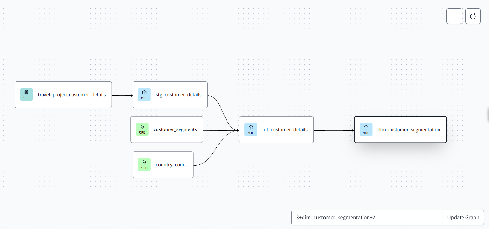
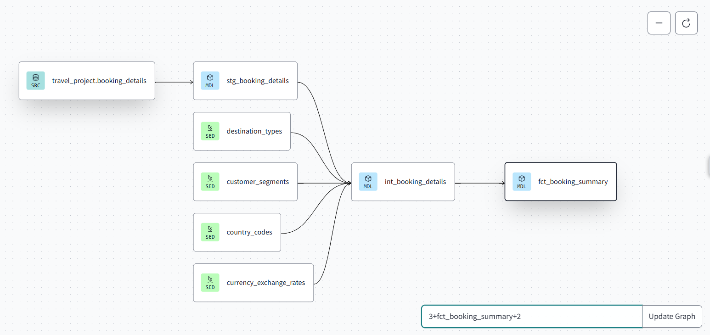

# DBT Pipeline for Travel Data Analytics

This project is designed for individuals looking to explore **DBT (Data Build Tool)**. I developed it to consolidate my understanding of DBT's core concepts and its seamless integration with Snowflake, to build scalable and efficient data transformation pipelines

### What is DBT?  
DBT is a powerful framework that helps us to write and organize SQL queries for data transformations. It also offers built-in documentation and testing features, helping you track our data transformations and ensure data quality throughout the process. It doesn't provide its own storage but relies on a data warehouse, like Snowflake, to execute the queries and manage the data.

### Goal  
The goal of this project is to explore and implement key DBT concepts, including models, sources, snapshots, tests (both built-in and custom), macros, pre and post hook and incremental materialization. This project aims to provide a hands-on understanding of how DBT can be used to streamline data transformation processes while ensuring data quality and efficiency

## lets start 
I have created a database and schema to store the raw data.  

```sql
CREATE DATABASE travel_db;  
CREATE SCHEMA raw;
``` 
I have added two tables to the raw schema:  

- `booking_details`  
- `customer_details`  

You can find the SQL scripts for these tables here:  
- [`Snowflake_code/customer_details.sql`](./Snowflake_code/customer_details.sql)  
- [`Snowflake_code/booking_details.sql`](./Snowflake_code/booking_details.sql)  

In DBT Cloud, I connected to Snowflake by adding:  Account ID, Database , Warehouse

### DBT Concepts File  
I created a file called `dbt_concepts` to document all the DBT concepts I’m learning while building this project.  

### `profiles.yml` -

`profiles.yml` file configures the connection between DBT and Snowflake. It defines how DBT should authenticate and connect to our Snowflake data warehouse.
When we run DBT commands, such as dbt run or dbt test, the profiles.yml file tells DBT how to connect to our Snowflake database using the specified configuration. By setting up the target as dev, DBT uses the connection details under the dev output.
This setup is flexible and allows us to add other environments like prod for production-level settings if needed.
- [`profiles.yml`](dbt/profiles.yml)


### `dbt_project.yml` -
The dbt_project.yml file is the configuration file that tells DBT how to run your project. It contains essential details about the project, including its name, version, profiles, model configuration, and more.
- [`dbt_project.yml`](dbt/dbt_project.yml)

### Seeds - 
In DBT, seeds are CSV files that we can load as tables into our database.  
I have used **4 seed files** in this project to load static data. 
- [`seeds`](dbt/seeds)

### `sources.yml` -
The sources.yml file is a configuration file to define metadata for the source data that we will use in our models. 
- [`sources.yml`](dbt/models/sources.yml)
  
This sources.yml file defines the metadata for two source tables in the TRAVEL_DB Snowflake database: booking_details and customer_details. It specifies the schema (raw) and provides descriptions for each table and its columns.

I have use **Freshness** parameter to ensure that the data being ingested or transformed is current and valid. Both the booking_details and customer_details tables have freshness checks that trigger:
  - A warning if the data is older than 1 hour.
  - An error if the data is older than 24 hours.
I have use Data Quality Tests to ensure things like booking_id is unique, essential fields like customer_id are not null, and status are always one of the accepted options.

### Models -
In DBT, models are SQL files where we define transformations to manipulate and clean our raw data. Each model represents a specific transformation or view that gets created in the database. These models help us break down complex processes into manageable, reusable parts, making the pipeline more efficient and easier to maintain.

To keep everything clear and organized, I have divided the DBT models into three distinct layers: Staging, Intermediate, and Marts.

1. Staging:
This layer contains models that load raw data directly from the source tables.

models/staging/stg_booking_details.sql
models/staging/stg_customer_details.sql

Both of these staging models are designed to structure raw data from the source tables in a way that makes it easier to work with in later stages of the pipeline.


2. Intermediate:
The intermediate models take the clean data from the staging layer and apply further transformations.

**int_booking_details** -
**Config Block**:
- **Materialization**: The model is set to be materialized incrementally (`materialized='incremental'`), meaning only new or changed records will be processed rather than reprocessing the entire dataset.
- **Pre-Hook and Post-Hook**: 
  - **Pre-hook**: Before the model runs, it inserts a log entry into the `model_run_log` table to track when the model execution starts.
  - **Post-hook**: After the model execution finishes successfully, it inserts another log entry to mark the model as complete.
   - The model pulls data from the `stg_booking_details` staging table (via `{{ ref('stg_booking_details') }}`) and joins it with other tables (`destination_types`, `customer_segments`, `country_codes`, and `currency_exchange_rates`).
   - This creates a more enriched version of the `booking_details` table
This setup ensures that only new and updated bookings are processed, and it logs the model's execution times for tracking purposes. It efficiently manages growing datasets by leveraging DBT’s incremental model functionality, reducing processing time and resources.

**int_customer_details** -
This model takes the data from the Staging layer (stg_customer_details.sql) and prepare it for business analysis and reporting. The joins with customer_segments and country_codes add valuable context to the data, allowing us to better understand customer demographics.

4. Marts:
The marts layer contains models that are optimized for business users and reporting tools.

**dim_customer_segmentation** -
This model is designed to create a Dimensional Table that can be used in reporting and analysis. It helps in understanding the distribution of customers across different segments and countries, providing valuable insights for decision-making and business strategy.





**fct_booking_summary** -
This model is part of the Fact layer and is focused on summarizing the booking data for analytical purposes. It's designed to aggregate key metrics, such as total spending and total bookings, at a detailed level by destination and country.It enables decision-makers to easily understand which destinations are most popular and where customers are spending the most.



macros -
It is a reusable block of code written in Jinja (a templating language). Macros  help automate repetitive tasks or complex logic by creating reusable functions that can be used across your models, tests, and other DBT files.
 custom_test.sql

 This macro is designed to check if a given column (in this case, total_bookings) contains any values that are less than or equal to zero. The purpose is to ensure that the total_bookings column always has values greater than zero,

schema.yml
This file defines the metadata and tests for the DBT models, ensuring data quality and consistency.It is used to enforce data integrity for our models by specifying:
Descriptions for better understanding of each column's purpose.
Tests that automatically validate the data quality and consistency, such as ensuring no null values in critical columns (country_name) and that the count of bookings is always greater than zero.

Snapshot -
In DBT , a snapshot is a way to capture and preserve the state of data over time, typically used for tracking slowly changing dimensions (SCDs). Snapshots allow us to track changes in your data over time, so we can analyze how records evolve
How DBT Snapshots Work:
Initial Load: On the first run, DBT takes a snapshot of the current state of the int_customer_details data.
Subsequent Runs: On subsequent runs, DBT compares the records using the unique key (customer_id) and the updated_at field. If a change is detected (e.g., if a customer's details have been modified), a new record is inserted into the snapshot table.
Preserving History: Unlike regular tables, snapshots preserve historical records, allowing you to track how a customer’s details change over time.


